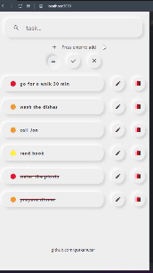
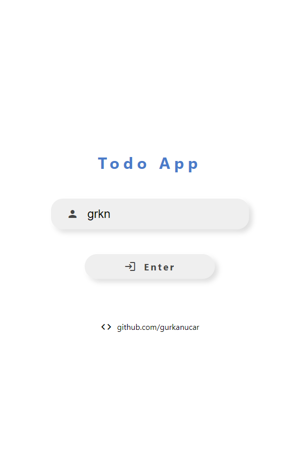
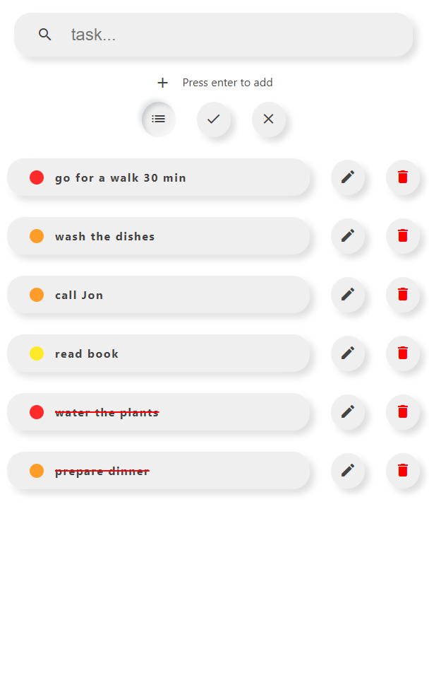
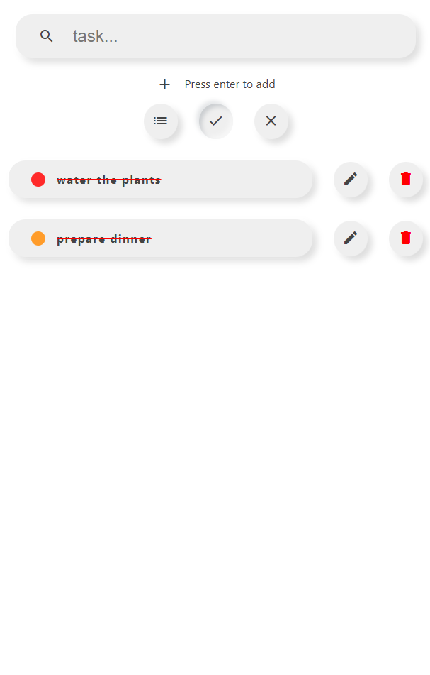
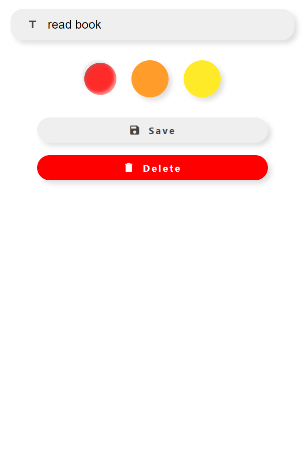

# Spring Boot GraphQL and React JS Todo-Application


- Spring Boot
- Exception Handling
- GraphQL
- Validation
- H2 Database

- React JS
- Apollo Client


[Postman Collection](https://github.com/gurkanucar/todo-app/blob/main/GraphQLTodo.postman_collection.json)

[Live Demo](https://todo-app-ten-mu.vercel.app)













## Usage/Examples

#### Api Endpoint
`/api/graphql`

#### Get All Todos


| Parameter | Type     | Description                |
| :-------- | :------- | :------------------------- |
| `id` | `ID` | **Required**. user id |
| `completed` | `Boolean` |  true or false|


- `get all todos - request`
```graphql
query {
  getAllTodos(id:1, completed:false ) {
        id task completed created priority
  }
}
```

- `get all todos - response`
```javascript
{
    "data": {
        "getAllTodos": [
            {
                "id": "3",
                "task": "go for a walk 30 min",
                "completed": false,
                "created": "2022-02-10 19:29:45.33",
                "priority": "HIGH"
            },
            {
                "id": "4",
                "task": "read book",
                "completed": false,
                "created": "2022-02-10 19:29:45.33",
                "priority": "HIGH"
            }
            ................
        ]
    }
}
```

#### Create Todo

| Parameter | Type     | Description                |
| :-------- | :------- | :------------------------- |
| `todo` | `CreateTodo` | **Required** |

create todo request

```

mutation {
  createTodo(todo : {task:"task" priority:"HIGH" user:{ id: 1} } ){
     id task completed created 
  }
}
```
create todo response

```javascript
{
    "data": {
        "createTodo": {
            "id": "8",
            "task": "task",
            "completed": false,
            "created": "2022-02-10 20:18:14.452"
        }
    }
}
```


#### Update Todo

| Parameter | Type     | Description                |
| :-------- | :------- | :------------------------- |
| `todo` | `UpdateTodo` | **Required** |

update todo request

```
mutation {
  updateTodo(todo : {id: 8, task:"task" priority:"HIGH" completed:true } ){
     id task completed created 
  }
}
```
update todo response

```javascript
{
    "data": {
        "updateTodo": {
            "id": "8",
            "task": "task",
            "completed": true,
            "created": "2022-02-10 20:18:14.452"
        }
    }
}
```

#### Delete Todo

| Parameter | Type     | Description                |
| :-------- | :------- | :------------------------- |
| `id` | `ID` | **Required** |

delete todo request

```
mutation {
  delete(id:8 ){
     id task completed created 
  }
}
```
delete todo response

```javascript
{
    "data": {
        "delete": {
            "id": "8",
            "task": "task",
            "completed": true,
            "created": "2022-02-10 20:18:14.452"
        }
    }
}
```

## Installation

- #### Clone

```bash
  git clone https://github.com/gurkanucar/todo-app.git
```

- #### run backend

```bash
  cd ./todo-be

  mvn spring-boot:run
```
    

- #### run frontend

```bash
  cd ./todo-fe

  npm Install

  npm start

```
    